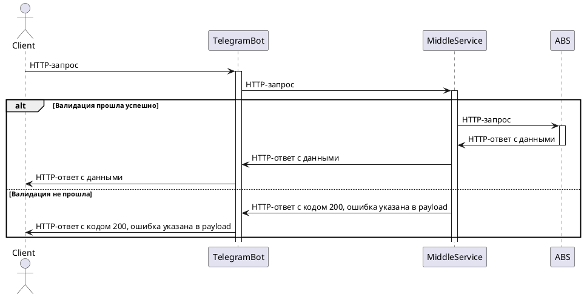

Middle service for telegram-bot
========================
Учебный проект в рамках GPBF. Middle service принимает запросы от telegram-бота, выполняет валидацию и бизнес логику,
маршрутизирует запросы в "банк"(сервис выступающий в качестве АБС).

## AS IS

[](https://git.io/typing-svg)

## TO BE

Предполагается, взаимодействие будет происходить таким образом:



### Для локального запуска проекта:

1. Скомпилировать jar:

```
./gradlew build  
```

2. Запустить

```
java -jar build/libs/gpbf-telegram-middle-0.0.1-SNAPSHOT.jar 
```

### Документация
[Ссылка на swagger](http://127.0.0.1:7070/swagger-ui/index.html)

